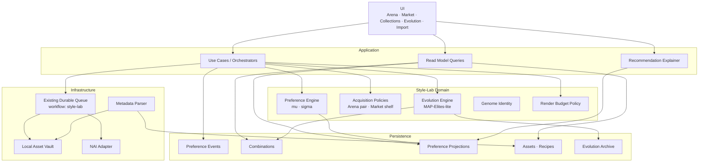

# Style-Lab 아키텍처 재설계 계획

> 대상: `JaCha00/nais_blue` Style-Lab
> 목적: Arena, Marketplace, Evolution, 이미지 가져오기를 하나의 일관된 취향 학습 시스템으로 통합한다.

## 1. 결론

이번 재설계의 핵심은 **Elo를 다른 점수표로 바꾸는 것**이 아니다. 다음 다섯 책임을 분리해야 한다.

| 책임 | 권장 설계 |
|---|---|
| 공정한 평가 | 고정된 `EvaluationContext`와 동일 `seedPack` |
| 취향 추정 | 후보별 `mu`, `sigma`를 가진 베이지안 선호 모델 |
| 후보 노출 | Arena는 정보량 기반, Marketplace는 Thompson Sampling |
| 새 세대 생성 | 품질과 다양성을 함께 보존하는 MAP-Elites-lite |
| 생성·자산 관리 | 기존 Durable Queue 재사용 + 원본 보존 Asset Vault |

권장 구현 순서는 다음과 같다.

```text
평가 조건 고정
→ 취향 이벤트 로그
→ mu/sigma Arena
→ Marketplace + 취향 보드
→ Durable Queue + Asset Vault
→ MAP-Elites-lite
→ 태그 특징 기반 모델
```

---

## 2. 현재 구조에서 해결할 문제

1. **비교 조건이 흔들린다.** 시드가 잠기지 않으면 후보마다 다른 시드가 사용되어 태그 조합보다 이미지 운을 평가하게 된다.
2. **Arena 쌍 선택이 비효율적이다.** Elo 정렬 뒤에도 실제 후보 쌍은 무작위로 선택된다.
3. **사용자 행동의 의미가 부족하다.** 즐겨찾기 하나로 좋아요, 재사용 의도, 숨기기, 적용을 구분할 수 없다.
4. **후보와 프리뷰가 1:1로 묶여 있다.** 한 장의 이미지가 조합 전체를 대표한다.
5. **다중 PNG 분석이 이미지별 조합을 합친다.** 서로 다른 스타일 계보가 하나로 섞일 수 있다.
6. **진화가 상위 Elo 계통에 빠르게 수렴한다.** 좋은 후보는 늘지만 다양성이 사라질 수 있다.
7. **프리뷰 작업이 메모리 기반 단일 루프다.** 앱 재시작 복구, 중복 방지, 우선순위, 비용 예약이 어렵다.
8. **단일 Zustand Store의 책임이 과도하다.** 후보, 전투, 진화, 프리뷰, 설정이 한곳에 모여 있다.
9. **평균 Elo는 진행 지표로 부적절하다.** 제로섬 업데이트에서는 평균이 거의 움직이지 않는다.
10. **명시적 스키마 버전과 마이그레이션 경계가 부족하다.** 구조 변경 시 복구와 롤백이 어렵다.

---

## 3. 설계 원칙

- **정확한 데이터가 복잡한 알고리즘보다 먼저다.** 초기에는 단순한 `mu/sigma` 모델로 시작한다.
- **Domain은 React, Zustand, Tauri, NAI API를 모른다.** 순수 TypeScript 로직으로 유지한다.
- **Store는 화면용 캐시다.** 영속 데이터의 원본은 Repository와 파일 Vault에 둔다.
- **취향 행동은 이벤트로 기록한다.** 점수와 통계는 이벤트에서 계산한 projection으로 취급한다.
- **전체 앱을 이벤트 소싱하지 않는다.** 취향 행동, 진화 계보, 렌더 연결 기록만 원본 로그화한다.
- **후보와 이미지를 분리한다.** 하나의 태그 조합은 여러 시드·컨텍스트·출처의 프리뷰를 가질 수 있다.
- **청사진 생성과 이미지 렌더를 분리한다.** 후보 생성은 무료, 렌더는 예산형 작업이다.
- **모든 결과를 재현 가능하게 만든다.** 컨텍스트 해시, RNG seed, 스키마·알고리즘·모델 버전을 기록한다.

---

## 4. 목표 아키텍처



### 레이어별 책임

| 레이어 | 책임 |
|---|---|
| UI | 사용자 행동 수집, 상태 표시, 비교·탐색 흐름 |
| Application | Use Case 조율, 트랜잭션 경계, 큐·예산·Repository 연결 |
| Domain | 선호 계산, 후보 선택, 진화, 식별자, 정책 |
| Persistence | 이벤트 원본, 조합, projection, 자산 참조, archive |
| Infrastructure | NAI 호출, 파일 저장, 메타데이터 해석, 내구성 작업 실행 |

---

## 5. 핵심 도메인 모델

| 모델 | 역할 | 핵심 필드 |
|---|---|---|
| `StyleCombination` | 태그 유전자와 계보를 가진 논리 후보 | tags, semanticHash, renderHash, lifecycle, lineage |
| `StylePreviewAsset` | 후보에 연결된 생성·가져오기 이미지 | comboId, sha256, contextId, seed, verificationState |
| `StyleEvaluationContext` | 공정한 비교를 위한 불변 생성 조건 | promptHash, planHash, model, sampler, seedPack |
| `StylePreferenceEvent` | 사용자 취향 행동의 원본 로그 | action, comboId, opponentId, boardId, slot, contextId |
| `PreferenceProjection` | 빠른 추천·표시용 파생 상태 | mu, sigma, evidence, views, lastShownAt |
| `TasteBoard` | 서로 다른 취향 방향을 분리하는 컬렉션 | name, exploration, autoEvolution, budgetId |
| `EvolutionLineage` | 자식 생성 근거와 재현 정보 | parents, operator, diff, rngSeed, algorithmVersion |
| `RenderBudget` | 자동 렌더 비용의 예약·확정 | limit, reserved, spent, unit |

### 식별자 규칙

- `semanticHash`: 태그 구성 중심의 스타일 계열 식별자
- `renderHash`: 태그 순서와 정확한 가중치까지 포함한 렌더 변형 식별자
- `asset.sha256`: 동일 원본 파일 중복 방지
- 렌더 작업 idempotency key:

```text
sha256(renderHash + contextId + seed + outputPolicyHash)
```

### 후보 생명주기

```text
draft → previewed → eligible → archived
```

- `draft`: 태그 청사진만 존재
- `previewed`: 프리뷰는 있으나 평가 조건 검증 전
- `eligible`: 같은 EvaluationContext에서 검증되어 Arena 참가 가능
- `archived`: 자동 노출에서 제외되지만 기록과 계보는 보존

---

## 6. 취향 이벤트 설계

권장 행동과 의미:

| 행동 | 의미 | 모델 반영 |
|---|---|---|
| impression | 실제 노출 | 점수 미반영, 반복·위치 편향 분석 |
| like | 순간적 호감 | 중간 긍정 |
| collect | 해당 보드로 발전시킬 의도 | 강한 긍정, 부모 풀 등록 |
| apply | 실제 사용 | 가장 강한 긍정 |
| hide | 명시적 비선호 | 부정 |
| pair-win | 상대보다 선호 | 강한 상대적 신호 |
| pair-tie | 두 후보가 비슷함 | 차이를 줄이는 신호 |
| skip | 판단 불가 | 점수 미반영 |
| undo | 이전 행동 철회 | `supersedesId`로 무효화 |

**아무 반응이 없었다는 사실을 싫어요로 해석하지 않는다.** 사용자가 보지 못했거나 판단을 보류했을 수 있다.

좋아요와 담기의 역할도 분리한다.

- 좋아요: 전역적으로 마음에 든다.
- 담기: 특정 TasteBoard에서 이 방향을 발전시키고 싶다.

---

## 7. 주요 기능 흐름

### 7.1 Arena

```text
TasteBoard와 EvaluationContext 선택
→ 평가 가능한 후보 필터링
→ 정보량이 높은 쌍 제안
→ 동일 seedPack 프리뷰 확인 또는 큐 등록
→ 승리 / 무승부 / 건너뛰기 이벤트 기록
→ mu/sigma projection 갱신
→ 다음 쌍 제안
```

초기 쌍 선택식:

```text
pairScore
  = preferenceCloseness
  × combinedUncertainty
  × exposureBalance
  × contextCompatibility
  × antiRepeat
```

후보가 많을 때는 전체 조합을 계산하지 않고 100~300쌍을 샘플링해 최고 점수를 선택한다.

### 7.2 Marketplace

단순 `mu` 내림차순 대신 한 화면의 역할을 분담한다. 기본 16개 진열대 예시:

- 8개: 예상 선호도가 높은 후보
- 4개: 불확실성이 높아 학습 가치가 큰 후보
- 2개: 새 세대 또는 미노출 후보
- 2개: 현재 보드와 다른 계통의 다양성 후보

각 버킷 안에서는 Thompson Sampling으로 순서를 정한다. 카드 위치는 세션마다 교차 배치해 상단·좌측 편향을 줄인다.

카드의 1차 액션:

```text
좋아요 | 컬렉션 담기 | 숨기기 | 프롬프트 적용 | 비교 트레이
```

수학 점수 대신 다음과 같은 추천 이유를 표시한다.

- 취향 적중 가능성 높음
- 아직 탐색 중
- 담아둔 스타일과 유사함
- 새로운 계열
- 동일 조건 검증 완료

### 7.3 Evolution

```text
명시적 행동 임계치 도달
→ 로컬에서 자식 청사진 생성
→ 중복·금지 규칙 검증
→ 선호도·불확실성·다양성으로 사전 평가
→ archive의 빈 셀 또는 약한 셀 우선 채움
→ 렌더 예산 안에서 일부만 큐 등록
→ 완료 자산을 Marketplace에 노출
```

초기에는 `MAP-Elites-lite`로 시작한다.

- 축 1: 태그 수 구간
- 축 2: 가중치 분포 형태
- 보조 niche: 태그 집합 유사도 클러스터
- 셀별 보존: Elite 1개, Challenger 1개, Novel 1개

변이 연산:

```text
태그 추가·삭제·교체
가중치 흔들기·혼합
태그 순서 교환·이동
부모 구간 splice
```

각 자식에는 부모, 연산자, 변경 diff, RNG seed, 알고리즘 버전을 기록한다.

### 7.4 이미지 가져오기

```text
파일 드롭
→ 원본 SHA-256 계산
→ 형식·크기·중복 검증
→ NAI 메타데이터 추출
→ 이미지별 ImportDraft 생성
→ 태그 포함·제외 검토
→ 원본을 Vault에 원자적으로 저장
→ Recipe · Combination · PreviewAsset 연결
→ 필요 시 동일 조건 재렌더
```

원칙:

- 여러 이미지를 하나의 조합으로 자동 합치지 않는다.
- 원본 파일은 재인코딩하지 않는다.
- 썸네일만 별도로 생성한다.
- raw metadata와 정규화 metadata를 함께 보존한다.
- 외부 이미지는 `source-only`로 시작하고, 같은 조건으로 재렌더된 뒤 Arena에 참여한다.

### 7.5 프리뷰 생성

새 작업 엔진을 만들지 않고 기존 Durable Queue에 Style-Lab Adapter를 추가한다.

```text
RenderRequest
→ Combination + EvaluationContext 불변 snapshot
→ idempotencyKey 계산
→ RenderBudget 예약
→ Durable Queue 등록
→ NAI 생성
→ Output Writer 저장
→ PreviewAsset 등록
→ 예산 확정 또는 반환
```

이 구조로 앱 재시작 복구, 중복 실행 방지, 취소, 재시도, 우선순위, 진행률 표시를 기존 인프라와 통합한다.

---

## 8. 알고리즘 적용 전략

### 초기 모델

- 후보마다 `mu`, `sigma`, `evidence`를 저장한다.
- Elo는 `legacyElo`로 보존하되 기본 UI에서는 제거한다.
- 전투가 적은 후보는 높은 `sigma`, 충분히 평가된 후보는 낮은 `sigma`를 가진다.
- PreferenceModel 인터페이스 뒤에 구현해 향후 교체 가능하게 한다.

### Marketplace 정책

```text
sampledTaste ~ Normal(mu, sigma²)
feedScore = sampledTaste + novelty + freshness - repeatPenalty
```

`mu`가 높은 후보만 반복하지 않고, 가능성은 있지만 아직 모르는 후보도 일정 비율 노출한다.

### 장기 모델

데이터가 충분해진 뒤 태그 특징 기반 Contextual Preference Model을 추가한다.

입력 특징:

- 태그 포함 여부와 가중치
- 태그 수와 순서 위치
- 자주 함께 등장하는 태그 쌍
- 세대와 계보
- TasteBoard
- EvaluationContext

목적은 새 자식을 렌더하기 전에 예상 효용을 계산해 **어떤 청사진을 먼저 렌더할지** 결정하는 것이다.

---

## 9. 저장과 상태 관리

| 데이터 | 저장 위치 |
|---|---|
| 조합, 보드, lineage, archive | IndexedDB Repository |
| PreferenceEvent | append-only IndexedDB store |
| PreferenceProjection | IndexedDB projection + UI 캐시 |
| 원본 이미지 | Tauri 파일 시스템 Vault |
| 썸네일·metadata | Vault 또는 관리형 앱 데이터 |
| 렌더 작업 | 기존 Durable Queue Repository |
| 현재 탭·필터·선택 | 작은 Zustand session store |

Store는 다음처럼 축소한다.

- `style-lab-session-store`: 탭, 검색, 필터, 비교 트레이
- `style-lab-read-store`: 화면에 필요한 projection 캐시
- 영속 쓰기: Use Case와 Repository를 통해 수행
- 이미지 data URL과 원본 바이트: Zustand 영속 상태에서 제외

---

## 10. 권장 코드 구조

```text
src/domain/style-lab/
  combination.ts
  identity.ts
  evaluation-context.ts
  preference-event.ts
  preference-model.ts
  acquisition-policy.ts
  taste-board.ts
  render-budget.ts
  evolution/
    archive.ts
    novelty.ts
    mutation.ts
    policy.ts

src/application/style-lab/
  record-preference.ts
  suggest-arena-pair.ts
  build-market-shelf.ts
  evolve-board.ts
  import-assets.ts
  request-preview-render.ts
  rebuild-projections.ts

src/services/style-lab/
  indexeddb-style-lab-repository.ts
  preference-projection-service.ts
  style-lab-queue-adapter.ts
  style-lab-vault.ts
  metadata-importer.ts

src/components/style-lab/
  StylePreviewCard.tsx
  ArenaView.tsx
  MarketplaceGrid.tsx
  CollectionBoardPicker.tsx
  ComparisonTray.tsx
  EvolutionArchiveView.tsx
  DropVault.tsx
  ImportReviewDialog.tsx
  LineageDrawer.tsx

src/stores/
  style-lab-session-store.ts
  style-lab-read-store.ts
```

교체 가능한 핵심 계약:

```ts
interface PreferenceModel {
  replay(events: StylePreferenceEvent[]): PreferenceModelState
  applyEvent(state: PreferenceModelState, event: StylePreferenceEvent): PreferenceModelState
  rank(state: PreferenceModelState, context: StyleEvaluationContext, boardId?: string): RankedCandidate[]
}

interface AcquisitionPolicy {
  suggestPair(input: PairSuggestionInput): [string, string] | null
  buildShelf(input: ShelfSuggestionInput): ShelfItem[]
}

interface EvolutionPolicy {
  propose(input: EvolutionInput): EvolutionProposal[]
}
```

---

## 11. UI 구조

권장 탭:

```text
Arena | 탐색 마켓 | 컬렉션 | 진화 | 이미지 가져오기 | 통계 | 설정
```

카드 설계:

- 기본: 이미지, 상태 배지, 좋아요, 담기, 숨기기, 적용
- 상세 패널: 태그 원문, 생성 파라미터, 계보, `mu/sigma`, 자산 목록
- 배지: `원본 참고`, `렌더 대기`, `동일 조건 검증`
- 추천 이유: 1~2문장으로 제공

평균 Elo 대신 표시할 지표:

- 평가 완료 후보 비율
- 평균 불확실성
- 추가 비교가 필요한 후보 수
- 보드별 계통 다양성
- 프리뷰 100장당 좋아요·담기·적용 수
- 확정 후보당 생성 비용
- 렌더 예산 사용량
- 자동 진화 준비도

---

## 12. 마이그레이션

1. 기존 `elo`를 `legacyElo`로 보존한다.
2. Elo 순위를 약한 `mu` prior로 변환한다.
3. 전투 횟수가 적은 후보는 높은 `sigma`로 초기화한다.
4. 기존 `favorite`은 약한 전역 긍정 prior로 변환하되 과거 이벤트를 임의 생성하지 않는다.
5. 기존 preview 필드를 최초 `StylePreviewAsset`으로 이동한다.
6. 모든 조합의 `semanticHash`, `renderHash`를 다시 계산한다.
7. 계보가 불완전한 기존 후보는 `legacy-import`로 표시한다.
8. Persist에 `version`, `migrate`, 사전 백업, 실패 시 복구 경로를 추가한다.
9. 1~2개 릴리스 동안 기존 export 형식과 읽기 호환성을 유지한다.

---

## 13. 단계별 실행 계획

| 단계 | 주요 범위 | 완료 기준 |
|---|---|---|
| Phase 0. 평가 기반 | EvaluationContext, 공유 seedPack, 이벤트 로그, 반복 방지, seeded RNG, migration 뼈대 | 같은 로그·시드에서 같은 결과 재현 |
| Phase 1. Bayesian Arena | `mu/sigma`, 정보량 기반 쌍, 무승부·건너뛰기, 새 통계 | 무작위 선택보다 적은 비교로 순위 안정화 |
| Phase 2. Marketplace | 좋아요·담기·숨기기·적용, TasteBoard, 버킷 진열, Thompson Sampling | 상위 후보 반복을 억제하고 보드별 추천 분리 |
| Phase 3. Queue & Vault | Style-Lab Queue Adapter, 1:N Asset, 원본 보존, Import Review, 비용 예약 | 재시작 복구, 중복 렌더 방지, 원본 해시 보존 |
| Phase 4. Evolution | MAP-Elites-lite, 여러 변이, lineage, 사전 평가, 자동 진화 예산 | 세대 진행 후에도 archive 다양성 유지 |
| Phase 5. Contextual Model | 태그 특징, 보드·컨텍스트 모델, 적응형 변이 | 렌더 전 선별이 무작위보다 높은 담기·적용률 달성 |

### 구현 진행 현황

#### 2026-07-24 · Phase 0 완료

- 순수 Domain에 버전된 seeded RNG, `StyleEvaluationContext`, `StylePreferenceEvent`, 반복 방지 Arena 정책을 추가했다.
- Arena 노출(`impression`)과 승패(`pair-win`)는 `nais2-style-lab-events` IndexedDB Repository에 append-only 원본으로 먼저 기록한다. 기존 Elo와 전적은 호환 projection으로 유지한다.
- Arena 두 후보의 프리뷰는 같은 immutable context ID와 같은 seed를 사용한다. 렌더 직전 현재 설정의 context hash가 달라지면 새 대결을 선택하도록 fail-closed 처리한다.
- 기존 조합 생성과 진화 난수도 persisted root seed와 operation sequence에서 파생한다.
- 기존 Persist에 명시적 schema/store version과 migration을 추가했다. 검증 가능한 context가 없는 과거 활성 대결은 마이그레이션 시 해제하고 조합·Elo 데이터는 보존한다.
- 새 이벤트 Repository는 전체 백업·복원 및 종료 flush 대상에 포함한다.
- Phase 3 이후 legacy preview 필드는 마지막 자산을 보여주는 호환 read model로만 남고, `seedPack` 전체 렌더와 1:N 원본 자산은 Durable Queue·Repository가 관리한다.

#### 2026-07-24 · Phase 1 완료

- 교체 가능한 `PreferenceModel` 경계 뒤에 결정론적 Gaussian `mu/sigma` 모델을 추가했다. 승리·무승부·단항 행동은 선호 projection을 갱신하고, 건너뛰기는 노출만 남긴 채 선호 근거를 만들지 않는다.
- 기존 `elo`, `battles`, `favorite`은 각각 frozen `legacyElo`, `legacyBattles`, `legacyFavorite` 약한 prior로 한 번만 반영한다. 현재 Elo 전적은 호환 UI projection으로 유지하되 기본 카드·통계에서는 제거했다.
- Arena는 `preferenceCloseness × combinedUncertainty × exposureBalance × antiRepeat` 점수로 최대 300개 후보 쌍을 평가한다. 후보가 많으면 persisted seeded RNG로 최대 200개 쌍을 표본화한다.
- Arena에 `비슷함(pair-tie)`과 `건너뛰기(skip)`를 추가하고, 판단 저장 후 다음 정보가치 쌍을 자동 제안한다. 무승부는 양쪽 불확실성을 낮추며 legacy 전적에는 `ties`로 함께 투영한다.
- 이벤트 전체 replay로 `PreferenceProjection`을 재생하고 `nais2-style-lab-events` schema v2에 파생 캐시를 저장한다. 캐시 쓰기 실패나 이전 모델 캐시는 원본 이벤트를 훼손하지 않으며 다음 replay에서 복구한다.
- 기본 지표를 평가 완료 후보 비율, 평균 불확실성, 추가 비교 필요 후보 수로 교체했다. 추가 비교 기준(`evidence < 3` 또는 `sigma > 0.9`)은 데이터가 축적되기 전의 초기 휴리스틱이다.
- 한국어·영어·일본어 Arena 문구를 선호 모델 기준으로 갱신했다. legacy Elo 기반 자동 정리는 기존 데이터 호환 기능임을 라벨에 명시했다.
- Phase 1 완료 시점 검증: Vitest 1,038개 통과·4개 건너뜀, TypeScript/Vite production build 통과, ESLint 통과.

#### 2026-07-24 · Phase 2 완료

- `TasteBoard` 도메인 엔티티와 Repository CRUD를 추가했다. `nais2-style-lab-events`는 schema v3로 올라가며 v1 이벤트와 v2 projection을 손실 없이 읽고, 마이그레이션된 저장소에는 안정적인 기본 보드를 생성한다.
- Marketplace는 기본 16개 선반을 선호 8개, 불확실성 탐색 4개, 새 세대·미노출 2개, 다양성 2개로 분담한다. 모든 버킷 안에서 seeded Gaussian Thompson 표본을 정렬 신호로 사용하고, novelty·freshness·최근 impression 반복 패널티를 함께 반영한다.
- 전역 `mu/sigma`와 현재 보드에 담긴 후보의 태그 Jaccard 유사도를 결합해 보드별 선반을 분리한다. 완전히 독립적인 보드별 contextual model은 데이터가 축적된 뒤 Phase 5에서 교체한다.
- 좋아요(`like`)는 전역 신호, 담기(`collect`)는 보드별 신호, 숨기기(`hide`)는 전역 제외 신호, 적용(`apply`)은 실제 사용 신호로 Repository에 먼저 기록한다. 좋아요·담기·숨기기 해제는 원본 이벤트를 수정하지 않고 `undo` 보상 이벤트로 처리한다.
- 탐색 마켓, 보드 컬렉션, 숨긴 조합 복원, 추천 이유·역할 배지, 비영속 2개 비교 트레이 UI를 추가했다. 비교 트레이의 두 후보는 새 immutable `EvaluationContext`와 동일 seed를 가진 Arena impression을 기록한 뒤 비교 화면으로 이동한다.
- 탭·활성 보드·비교 트레이는 `style-lab-session-store`, projection·보드 읽기 캐시는 `style-lab-read-store`, 영속 쓰기는 Application Use Case와 Repository가 담당한다.
- Phase 3 이후 Marketplace 카드는 Repository의 1:N 자산 수를 표시하고 Durable Queue에 프리뷰를 요청한다. Arena 투표는 현재 EvaluationContext로 검증된 두 후보에만 열리며, 청사진은 렌더 전에도 탐색 대상으로 유지한다.

#### 2026-07-26 · Phase 3 완료

- 조합 생성·마이그레이션에서 `semanticHash`, `renderHash`, `draft → previewed → eligible → archived` 생명주기를 관리한다. 의미 해시는 태그 계열을, 렌더 해시는 순서와 정확한 가중치를 구분한다.
- `StylePreviewAsset`을 조합과 분리해 seed·context별 1:N 자산을 저장한다. 카드의 기존 preview 필드는 마지막 결과를 보여주는 호환 read model이며 Repository가 불변 자산 링크의 원본이다.
- 기존 Durable Queue에 `style-lab` 실행기를 연결했다. 조합·컨텍스트·seed·출력 정책의 불변 snapshot, content-derived idempotency key, managed resource materialization, Output Writer 트랜잭션, Queue Center 재시도·취소·재시작 복구를 그대로 사용한다.
- 수동 렌더 기본 예산은 10,000회, 자동 보드의 최초 예산은 20회라는 운영 휴리스틱을 적용했다. 렌더 등록 전에 예약하고 성공 시 확정하며, 실패·취소·누락 작업은 drain 또는 앱 재시작 복구에서 반환한다.
- Asset Vault는 AppData 아래 content-addressed 경로에 원본 바이트를 temp-write/rename 방식으로 저장하고 SHA-256을 다시 검증한다. PNG/WebP를 재인코딩하지 않으며 동일 digest는 한 원본 경로를 공유한다.
- 이미지 가져오기는 파일마다 별도 `ImportDraft`를 만들고 태그 포함 여부를 검토한 뒤 저장한다. raw/normalized metadata를 함께 보존하고 외부 원본은 `source-only`로 시작한다. 여러 파일의 태그를 하나의 조합으로 자동 합치지 않는다.
- Arena의 승리·무승부 액션은 양쪽 후보가 현재 EvaluationContext에서 `eligible`일 때만 활성화된다. 미검증 청사진은 같은 컨텍스트 렌더를 Queue에 먼저 등록할 수 있다.

#### 2026-07-26 · Phase 4 완료

- 태그 수(`compact/balanced/dense`)와 가중치 형태(`flat/mixed/focused`)의 9개 기본 셀을 사용하는 `MAP-Elites-lite`를 추가했다. 보조 tag-set niche를 계산하고 셀마다 Elite, Challenger, Novel을 서로 다른 후보로 유지한다.
- 태그 추가·삭제·교체, 가중치 jitter·mix, 순서 swap·move, 부모 splice의 8개 결정론적 변이 연산을 구현했다. 태그 수·중복·가중치 범위는 변이 직후 최소한으로 복구한다.
- 모든 자식은 부모 ID, 연산자, diff, RNG seed, 알고리즘 버전, 세대, 보드가 담긴 불변 `EvolutionLineage`를 Repository에 저장한다. 과거 persisted 후보의 불완전한 계보는 `legacy-import`로 명시한다.
- 진화는 무료 청사진을 먼저 만들고 선호도·불확실성·다양성으로 사전 평가한 뒤 archive를 갱신한다. 보드에서 예산형 자동 렌더를 켠 경우에만 실행당 상위 2개를 낮은 우선순위로 Durable Queue에 등록한다.
- 진화 탭에 점유 archive 셀과 Elite/Challenger/Novel을 표시하고, 보드 설정에 예산형 자동 렌더 opt-in을 추가했다.

#### 2026-07-26 · Phase 5 완료

- `style-contextual-linear-v1` 모델이 태그 포함·가중치·순서, 태그 쌍, 세대·계보, TasteBoard 교차 특징, 모델·sampler·prompt/plan context 특징을 추출한다.
- append-only 활성 이벤트를 보드별 결정론적 online ridge update로 replay한다. `collect/apply`는 해당 보드에만 강한 신호를 주고, `like/hide`는 전역 신호로 공유하며 undo된 이벤트는 학습에서 제외한다.
- Marketplace는 Gaussian 후보 projection과 보드별 contextual `mu/sigma`를 혼합해 Thompson 진열을 구성하고 `board-context` 추천 이유를 표시한다.
- Evolution은 새 청사진 자체를 contextual model로 다시 평가해 렌더 순서를 정한다. 학습된 tag/weight/order/pair 특징 신호는 다음 변이의 add·mix·move·splice 연산 비중을 적응적으로 조정한다.
- 실제 장기 담기·적용률은 운영 데이터가 축적되어야 판단할 수 있다. 현재 완료 기준은 합성 이벤트에서 보드별 상위 렌더 선별 적중률이 50% 무작위 기준보다 높고, 같은 로그에서 모델·순위·변이가 재현되는 것으로 제한했다.
- Phase 3–5 완료 시점 검증: Vitest 1,069개 통과·4개 건너뜀, TypeScript/Vite production build 통과, ESLint 통과.
- 한국어·영어·일본어에 보드 관리, Marketplace 행동, 역할 버킷, 추천 이유, 컬렉션·숨김 복원 문구를 추가했다.
- Phase 2 완료 시점 검증: Vitest 1,051개 통과·4개 건너뜀, TypeScript/Vite production build 통과, ESLint 통과.

---

## 14. 테스트 전략

- **Characterization**: 기존 Style-Lab 생성 payload와 저장 흐름 고정
- **Determinism**: 동일 이벤트·시드·버전에서 동일 결과 확인
- **Property**: 변이 후 태그 수, 가중치 범위, 중복 금지 검증
- **Migration Fixture**: 기존 Store 버전별 변환 결과 검증
- **Crash Recovery**: 큐 재시작, 저장 중단, 예산 예약 반환 검증
- **Fairness**: 같은 EvaluationContext와 seedPack 사용 확인
- **Bias**: 슬롯별 반응률, 반복 노출률, 버킷별 노출량 확인
- **Cost**: 자동 진화가 설정된 렌더 상한을 넘지 않는지 확인

---

## 15. 성공 지표

### 사용자 경험

- 첫 컬렉션 담기까지 필요한 평가 수
- 프리뷰 100장당 좋아요·담기·적용 수
- 컬렉션 후보의 실제 프롬프트 적용률
- 보드별 추천 재방문율
- 이미지 가져오기 완료율

### 모델 품질

- 평균 불확실성 감소율
- 같은 쌍 반복 노출률
- 재검증 비교 일치율
- 상위 후보 순위 안정성
- 세대별 archive 점유율과 계통 다양성

### 운영 안정성

- 확정 후보당 렌더 비용
- 중복 렌더 방지 건수
- 렌더 실패·재시도·복구율
- 원본 자산 무결성 오류
- 마이그레이션 실패·롤백 건수

---

## 16. 최종 의사결정

1. Elo 교체보다 `선호 모델`, `노출 정책`, `진화 정책`의 분리를 우선한다.
2. 공정한 EvaluationContext와 이벤트 로그를 가장 먼저 구현한다.
3. 전체 이벤트 소싱은 피하고 취향 행동만 원본 로그화한다.
4. 별도 프리뷰 엔진 대신 기존 Durable Queue의 `style-lab` workflow를 사용한다.
5. 후보와 이미지를 1:N으로 분리한다.
6. 원본 이미지는 재인코딩하지 않는 불변 자산으로 보존한다.
7. 자동 진화와 자동 렌더를 분리하고 렌더에는 명시적 예산을 적용한다.
8. 여러 취향은 TasteBoard별 모델과 계보로 분리한다.
9. 추천 이유를 제공해 사용자가 알고리즘의 방향을 이해하고 조정하게 한다.
10. 스키마, 모델, 알고리즘, RNG seed 버전을 중요한 결과마다 기록한다.

이 구조에서 Arena는 정밀 측정실, Marketplace는 발견의 진열대, Evolution은 다양성을 지키는 온실이 된다. 세 기능은 서로 경쟁하지 않고 하나의 취향 기억을 공유하는 세 가지 작업 방식으로 통합된다.
