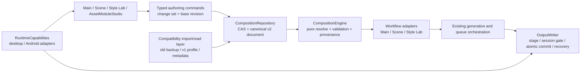

# Composition v2 architecture

기준일: 2026-07-13 (Asia/Seoul)

## Boundaries

- `src/domain/composition/**`: React, Zustand, Tauri, IndexedDB, Node, filesystem, Sharp, SQLite를 import하지 않는 pure domain.
- `CompositionRepository`: authority, revision, CAS, staging, migration lease와 canonical command commit의 유일한 persistence boundary.
- `CompositionEngine`: recipe/modules/characters/params/random/output을 deterministic plan으로 resolve하고 warning/error/random trace/provenance를 반환.
- workflow adapters: Main/Scene/Style Lab의 입력을 engine input으로 materialize한다. 기존 queue/session/cancel orchestration은 소유하지 않는다.
- `RuntimeCapabilities`: absolute path, file watch, tagger, embedded browser, R2 tooling, embedded PNG metadata, image formats를 platform adapter로 분리한다.
- `OutputWriter`: API response를 temp에 stage한 뒤 session `canCommit()`, atomic rename, workflow callback, journal recovery 순서로 저장한다.
- compatibility layer: historical data를 canonical v2로 import/read하지만 새 authoring write authority가 아니다.

## Current authority caveat

아키텍처의 canonical target은 v2지만 production startup의 fresh default authority는 아직 `legacy`다. Repository가 v2를 검증하고 명시적으로 활성화한 session만 v2 document를 workflow에 제공한다. 그러므로 diagram의 legacy layer를 final cleanup에서 제거하면 현재 fallback과 rollback contract가 깨진다.
