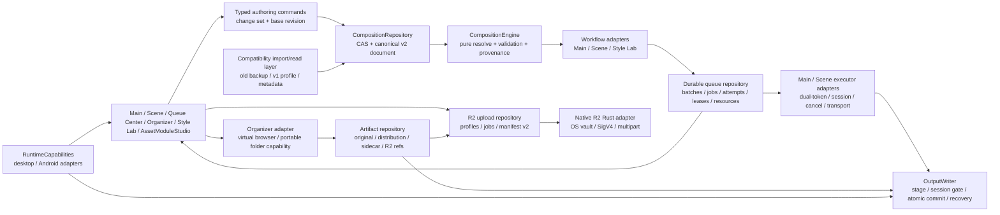

# Composition v2 architecture

기준일: 2026-07-14 (Asia/Seoul)

## Boundaries

- `src/domain/composition/**`: React, Zustand, Tauri, IndexedDB, Node, filesystem, Sharp, SQLite를 import하지 않는 pure domain.
- `CompositionRepository`: authority, revision, CAS, staging, migration lease와 canonical command commit의 유일한 persistence boundary.
- `CompositionEngine`: recipe/modules/characters/params/random/output을 deterministic plan으로 resolve하고 warning/error/random trace/provenance를 반환.
- workflow adapters: Main/Scene/Style Lab의 입력을 engine input으로 materialize한다. Main/Scene enqueue adapter는 resolved plan을 immutable queue snapshot으로 고정하고 required resource를 managed AppData에 materialize한다.
- durable queue repository: Main/Scene의 새 enqueue와 claim/snapshot/status authority다. CAS lease, attempt,
  progress, retry lineage, batch failure policy와 output transaction linkage를 transaction/readback으로 소유한다.
- executor adapters: current dual-token scheduler, streaming/source-edit 제한, generationSessionId/cancel/stale
  guard, NovelAI transport, save/history/image release 경계를 재사용한다. Queue는 이 계약을 대체하지 않는다.
- R2 upload repository: non-secret R2ProfileV2, resumable UploadJob의 upload ID/completed parts와 manifest v2를
  별도 IndexedDB에 저장한다. Rust adapter만 OS vault secret을 읽고 official S3 SDK request를 수행한다.
- Organizer artifact repository: `ArtifactRecord`가 immutable original checksum, portable file reference, thumbnail
  cache identity, distribution variants/sidecar와 R2 object reference만 별도 IndexedDB에 저장한다. Raw absolute
  path, opaque platform token, prompt/image byte, credential, Authorization과 signed URL은 authority data가 아니다.
- Organizer collection adapter: managed AppData collection과 desktop external folder를 RuntimeCapabilities/portable
  token registry로 materialize한다. External raw path는 process-local platform token에만 존재하고 UI/adapter가
  OutputWriter를 우회해 file mutation을 수행하지 않는다.
- `RuntimeCapabilities`: absolute path, file watch, tagger, embedded browser, legacy R2 tooling, native R2 profile/
  foreground/background upload, embedded PNG metadata, image formats를 platform adapter로 분리한다.
- `OutputWriter`: API response를 temp에 stage한 뒤 session `canCommit()`, atomic rename, workflow callback,
  journal recovery 순서로 저장한다. Durable execution은 prebound transaction/sourceJob ID를 사용하고
  terminal job commit 뒤 cleanup fault가 artifact rollback으로 되돌아가지 않게 한다.
  Organizer distribution은 image/metadata sidecar/organizer artifact sidecar를 같은 recovery journal에서
  commit·rollback하며 output checksum을 result로 반환한다.
- compatibility layer: historical data를 canonical v2로 import/read하지만 새 authoring write authority가 아니다.

## Current authority caveat

아키텍처의 canonical target은 v2지만 production startup의 fresh default authority는 아직 `legacy`다. Repository가 v2를 검증하고 명시적으로 활성화한 session만 v2 document를 workflow에 제공한다. 그러므로 diagram의 legacy layer를 final cleanup에서 제거하면 현재 fallback과 rollback contract가 깨진다.

Queue execution authority는 Composition authority와 별도다. Phase 08의 기본은 `durable`이며 명시적
rollback에서만 retained legacy Main/Scene 실행을 선택한다. 기존 Scene `queueCount`는 한 release 동안
읽기/변환 compatibility로 남고 변환 뒤에도 자동 삭제되지 않는다. Durable queue record, managed resource,
OutputWriter journal을 rollback 과정에서 삭제하거나 output path만으로 성공을 추론하지 않는다.

## Phase 10 organizer distribution boundary

Organizer는 current collection의 thumbnail을 fixed-grid virtualization으로만 읽고, Enter/drag/touch slot
assignment는 pure assignment helper로 duplicate artifact를 막는다. Distribution policy는 portable destination,
sanitized filename/collision, PNG/WebP quality, alpha/matte, metadata strip/preserve와 optional existing R2 profile
reference를 snapshot한다. Rename/copy/strip의 same-format preserve path는 raw container bytes를 쓰며,
conversion은 WebView Canvas만 사용한다. Canvas가 lossless WebP를 증명할 수 없으면 성공처럼 re-encode하지
않고 typed failure로 멈춘다.

PNG/WebP/JPEG raw chunk/segment scanner와 decode-level alpha/color verifier를 함께 사용한다. Original은
checksum이 달라지면 distribution 전에 fail-closed하며 never mutate한다. Successful distribution mutation은
OutputWriter commit callback이 ArtifactRecord sidecar/variant link를 atomic file commit 뒤에만 쓰고, optional
R2는 existing resumable queue에 enqueue만 한다.
